# 🎬 BlowMe AI — YouTube Management & Analysis Platform

<div align="center">


**An all-in-one command center for YouTube content creators — track channels, spy on competitors, generate AI scripts, and dominate your niche.**

</div>

---

## 🗺️ Platform Overview — Mind Map

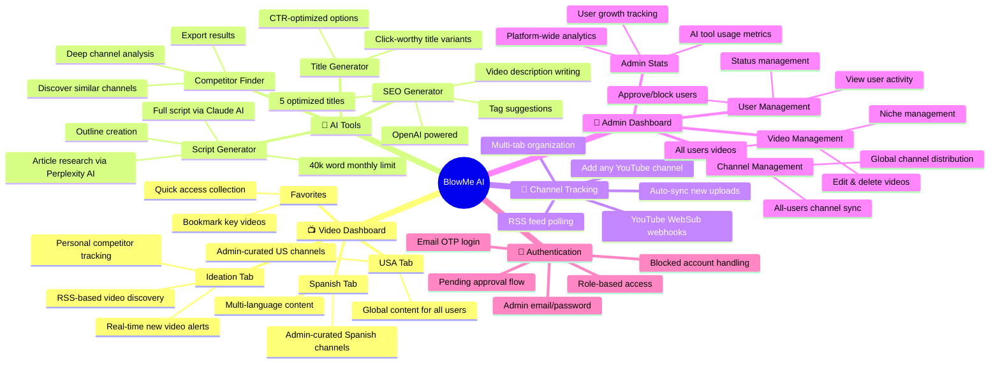

---

## 🎯 What Is BlowMe AI?

**BlowMe AI** is a private, invite-only YouTube intelligence platform designed for professional content creators and their teams. It centralizes everything a YouTube creator needs:

- 🔍 **Spy on competitors** — track any YouTube channel's uploads in real-time via RSS feeds and YouTube WebSub webhooks
- 📊 **Organize video intelligence** — curate videos into Ideation, USA, and Spanish buckets for your content team
- 🤖 **Generate AI content** — go from a topic idea to a full production-ready script in minutes
- 📈 **Track your metrics** — see what's performing across channels and niches
- 👥 **Manage your team** — admin controls for approving users, distributing content, and monitoring tool usage

---

## 📸 Platform Gallery

Explore the BlowMe AI platform through these screenshots:

<details>
<summary><b>Click to view gallery</b></summary>

### Authentication

<br />


### Dashboards
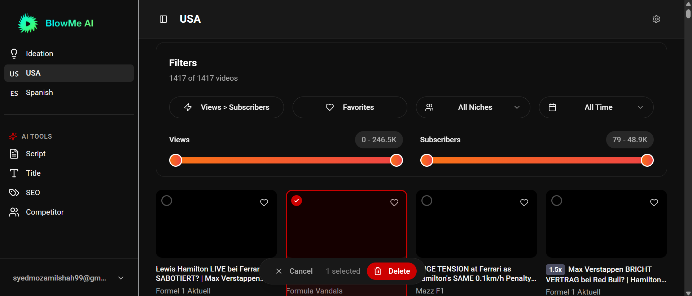
<br />

<br />

<br />


### Features & Tools

<br />

<br />

<br />

<br />

<br />


</details>

---

## 👥 User Roles & Access

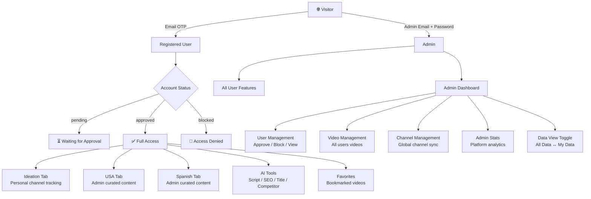

---

## 📺 Main Dashboard — Video Tabs

The main dashboard has three content tabs, each serving a distinct purpose:

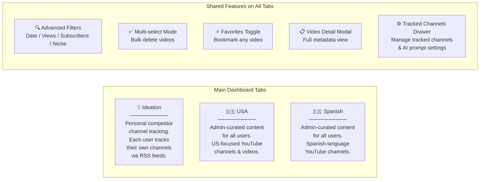

---

## 📡 Channel Tracking System

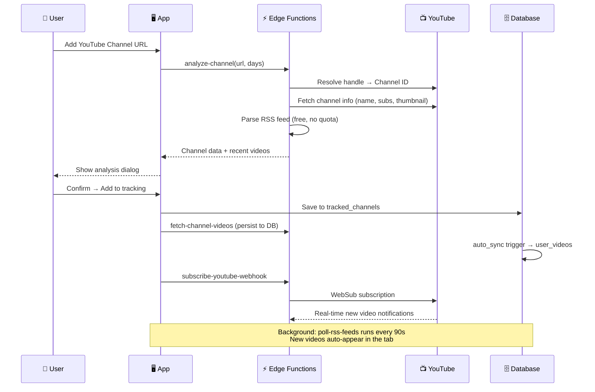

---

## 🤖 AI Tools Suite

```mermaid
flowchart TD
    subgraph TOOLS["🛠️ AI Tools"]

        subgraph SCRIPT["📝 Script Generator"]
            S1[Enter Topic / Article URL] --> S2[AI Analyzes via Perplexity]
            S2 --> S3[Research Outline Created]
            S3 --> S4{User Reviews Outline}
            S4 -->|Edit if needed| S3
            S4 -->|Approve| S5[Claude AI Generates Full Script]
            S5 --> S6[Edit, Copy & Save Script]
        end

        subgraph SEO["🔖 SEO Generator"]
            E1[Enter Topic + Keywords] --> E2[OpenAI generates 5 Titles]
            E2 --> E3[Video Description Generated]
            E3 --> E4[Tag Suggestions Provided]
            E4 --> E5[Copy & Use in YouTube Studio]
        end

        subgraph TITLE["🔤 Title Generator"]
            T1[Enter Video Concept] --> T2[Multiple Title Variants]
            T2 --> T3[AI Chat to Refine Titles]
            T3 --> T4[Copy Best Title]
        end

        subgraph COMP["🔍 Competitor Finder"]
            C1[Enter a Channel URL] --> C2[Deep Channel Analysis]
            C2 --> C3[Find Similar Channels]
            C3 --> C4[View Their Stats & Content]
            C4 --> C5[Save Analysis to History]
        end
    end

    MONTHLY["📊 40,000 Word\nMonthly Limit\nTracked per user"] -.-> SCRIPT
    MONTHLY -.-> SEO
```

---

## 👑 Admin Dashboard

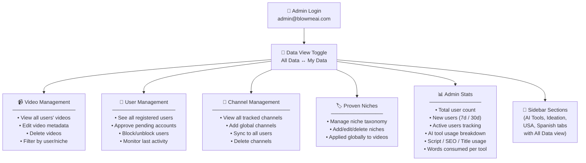

---

## 🔐 Authentication Flow

```mermaid
flowchart TD
    A[🌐 User visits app] --> B{Already logged in?}
    B -->|Yes, Admin| C[Redirect → Main Dashboard]
    B -->|Yes, Approved User| D[Redirect → Main Dashboard]
    B -->|Yes, Pending| E[Redirect → Pending Approval Page]
    B -->|Yes, Blocked| F[Redirect → Blocked Page]
    B -->|No| G[Auth Page]

    G --> H{Login Method}
    H -->|Regular User| I[Enter Email → Receive OTP Code]
    I --> J[Enter 6-digit OTP]
    J --> K{Account exists?}
    K -->|New User| L[Account Created → Status: Pending]
    K -->|Existing| M[Login → Check Status]
    L --> E
    M --> D

    H -->|Admin| N[/admin route\nEmail + Password]
    N --> O{Is admin email?}
    O -->|Yes| C
    O -->|No| P[Access Denied → Sign Out]
```

---

## 🔄 Real-Time Video Sync Architecture

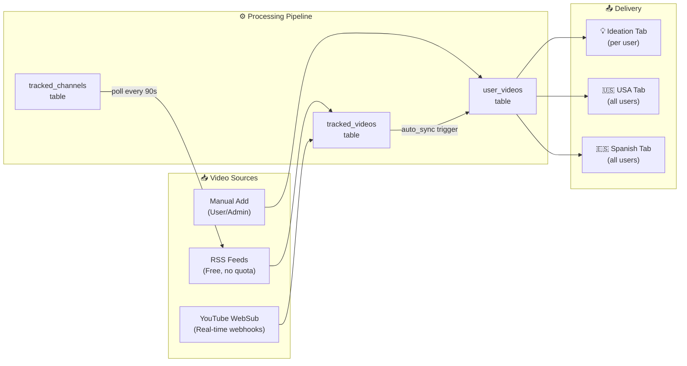

---

## 🏗️ Technology Stack

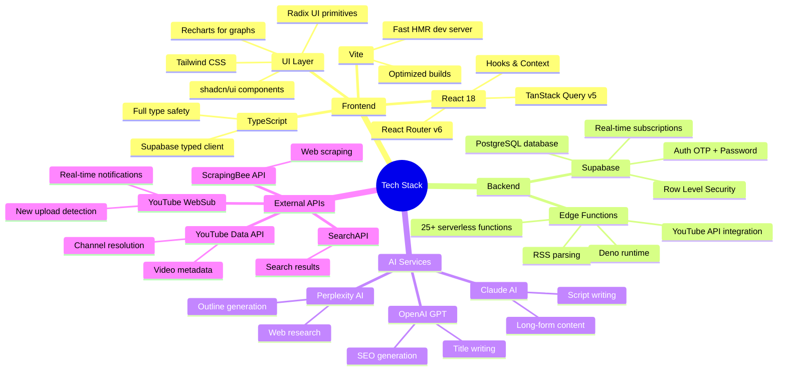

---

## 📊 Feature Matrix

| Feature | Regular User | Admin (My Data) | Admin (All Data) |
|---|:---:|:---:|:---:|
| View Ideation Tab | ✅ Own videos | ✅ Own videos | ✅ All users' videos |
| View USA Tab | ✅ View only | ✅ View + Add | ✅ View + Add for all |
| View Spanish Tab | ✅ View only | ✅ View + Add | ✅ View + Add for all |
| Add channels (Ideation) | ✅ | ✅ | ❌ (viewing all) |
| Script Generator | ✅ | ✅ | ✅ |
| SEO Generator | ✅ | ✅ | ✅ |
| Title Generator | ✅ | ✅ | ✅ |
| Competitor Finder | ✅ | ✅ | ✅ |
| Favorites | ✅ Own | ✅ Own | ✅ All users' |
| User Management | ❌ | ✅ | ✅ |
| Admin Stats | ❌ | ✅ | ✅ |
| Delete any video | ❌ | ✅ Own | ✅ Any user's |
| Manage niches globally | ❌ | ✅ | ✅ |

---

## ⚡ Supabase Edge Functions

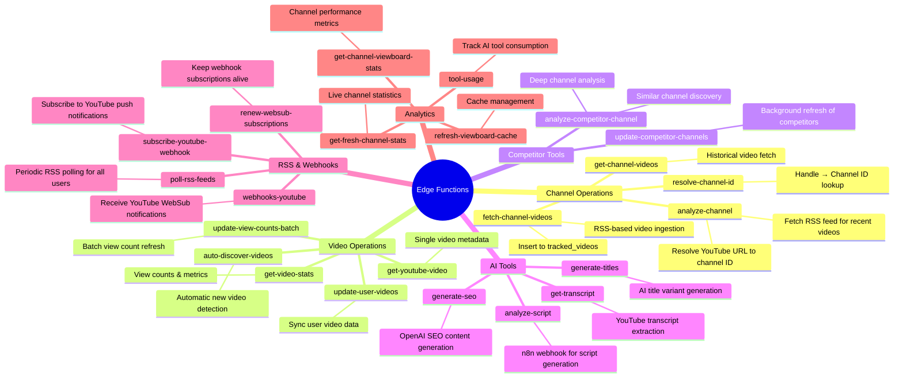

---

## 🗄️ Data Model Overview

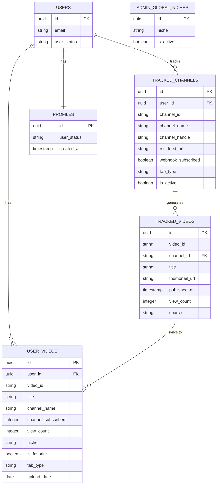

---

## 🚦 System Status & Background Jobs

| Job | Trigger | Frequency | Purpose |
|---|---|---|---|
| RSS Poll | User on Ideation page | Every 90 seconds | Check tracked channels for new videos |
| Video Sync | On page load | Once per session | Sync missed videos to user's library |
| Metadata Refresh | On page load | Once per session | Fix timestamps, niches, view counts |
| Real-time Insert | WebSub notification | Instant | New uploads appear immediately |
| WebSub Renewal | Cron job | Periodic | Keep webhook subscriptions alive |
| Competitor Update | Cron job | Every 12 hours | Refresh competitor channel data |

---

## 🛡️ Security & Access Control

```mermaid
flowchart TD
    REQ["Incoming Request"]

    REQ --> RLS["Row Level Security\nPostgreSQL RLS Policies"]

    RLS --> CHECK{User Type}

    CHECK -->|Regular User| OWN["Can only read/write\nown user_id rows"]
    CHECK -->|Admin| ADMIN_CHECK{Admin Email Match}

    ADMIN_CHECK -->|admin@blowmeai.com| ALL["Full access to\nall data"]
    ADMIN_CHECK -->|Other| OWN

    OWN --> TABS["Ideation: own channels only\nUSA/Spanish: read-only\n(admin writes for all)"]
    ALL --> GLOBAL["Full CRUD on all tables\nUser management\nGlobal channel distribution"]
```

---

## 📱 Application Routes

| Route | Access | Description |
|---|---|---|
| `/auth` | Public | Email OTP login for regular users |
| `/admin` | Public | Admin email + password login |
| `/` | Protected | Main dashboard (Ideation tab default) |
| `/?tab=ideation` | Protected | Personal competitor tracking |
| `/?tab=usa` | Protected | USA curated content |
| `/?tab=spanish` | Protected | Spanish curated content |
| `/?tab=title-generator` | Protected | AI title generation tool |
| `/tools?tab=script` | Protected | AI script generator |
| `/tools?tab=seo` | Protected | AI SEO generator |
| `/tools?tab=competitor` | Protected | Competitor channel finder |
| `/favorites` | Protected | Bookmarked videos |
| `/admin/dashboard` | Admin only | Admin video management |
| `/admin/users` | Admin only | User management |
| `/admin-stats` | Admin only | Platform analytics |
| `/pending-approval` | Registered | Waiting for admin approval |
| `/blocked` | Blocked | Account blocked notice |

---

## 🔑 Admin Access

> **Admin Login URL:** `/admin`
>
> The admin account is identified by a hardcoded email in the system. The password is managed through Supabase Authentication. Contact the repository owner for credentials.

---

## 🏁 Getting Started

**Prerequisites:** Node.js 18+, a Supabase project, YouTube API key, OpenAI API key

**1 — Clone**

> `git clone https://github.com/syedmozamilshah/yt_management_and_analysis.git`

**2 — Install dependencies**

> `npm install`

**3 — Configure environment** — Create `.env` with your Supabase project URL, anon key, and project ID

**4 — Deploy Supabase** — Run migrations from `supabase/migrations/`, deploy edge functions from `supabase/functions/`

**5 — Start dev server**

> `npm run dev` → open `http://localhost:5173`

---

## 📜 Available Commands

| Command | Description |
|---|---|
| `npm run dev` | Start local development server |
| `npm run build` | Build for production |
| `npm run build:dev` | Build in development mode |
| `npm run preview` | Preview the production build |
| `npm run lint` | Run ESLint code checks |

---

<div align="center">

Built with ❤️ by the BlowMe AI team · Private & Proprietary


</div>
